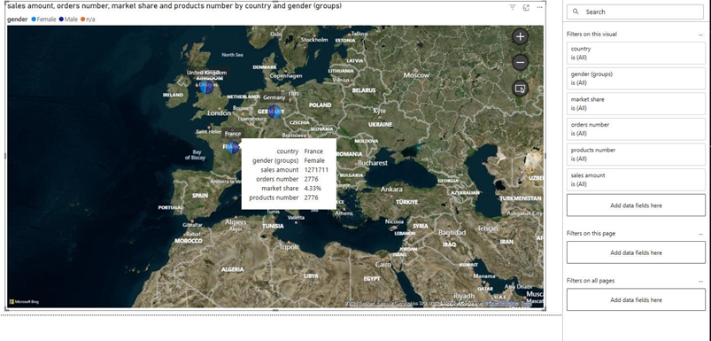
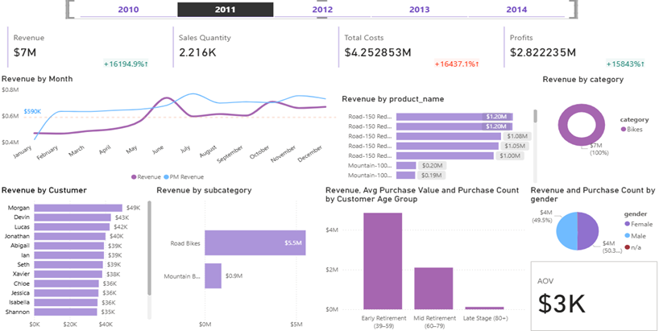

# Data Warehouse and Business Intelligence Project

Welcome to the **Data Warehouse and Business Intelligence Project** repository! 🚀

This project demonstrates a complete BI solution designed as part of my Final Year Project (PFA) at EMSI, developed with my teammate **Salma Ben Yamna**. It showcases the full pipeline from raw data ingestion to insightful analytics and visualizations, leveraging modern data engineering principles and visualization tools.

---

Data Warehouse source :   

## 🏗️ Data Architecture

Our data architecture follows the **Medallion Architecture** with three layers: **Bronze**, **Silver**, and **Gold**, ensuring efficient data processing and quality control.

* **Bronze Layer**: Raw sales data ingested as-is from CSV sources.
* **Silver Layer**: Data cleansing, standardization, and normalization performed to prepare data for analysis.
* **Gold Layer**: Business-ready data modeled into a star schema optimized for analytical queries and reporting.

---

## 📖 Project Purpose & Overview

The purpose of this project is to provide a data-driven Business Intelligence platform that offers **clear, actionable insights into sales performance across geographical regions and product segments**, enabling informed decision-making for companies.

Key components:

* Structuring complex sales data for improved accessibility and analysis
* Applying Medallion Architecture for data reliability and scalability
* Building interactive dashboards for visualization of sales trends and customer segmentation

---

## 🔧 What We Built

* **Medallion Architecture** implementation across Bronze, Silver, and Gold layers
* Data cleansing and transformation pipelines to standardize input data
* Star schema data modeling for efficient querying and reporting
* **Power BI Dashboards** for dynamic visualization including:

  * **Geographical Sales Map:**

  
 
    Visualizing sales distribution by country and gender.

  * **Sales Analysis Dashboard with KPIs:**
  
    
     Featuring dynamic KPIs such as total sales, growth rates, top-performing products, and customer segmentation metrics, providing a real-time pulse of business performance

---

## 📈 Key Learnings

* Hands-on experience with layered data architectures and ETL processes
* Advanced data modeling techniques in star schema design
* Practical skills in transforming raw data into business intelligence
* Effective storytelling through interactive dashboards using Power BI

---

## 🛠️ Tools & Technologies

* SQL Server for data storage and ETL operations
* Power BI for analytics and reporting
* Python and/or SQL scripts for data processing and transformation
* Medallion Architecture framework

---

## 📂 Repository Structure

sql-data-warehouse-project/

├── datasets/                           # Raw datasets used for the project (ERP and CRM data)
│
├── docs/                               # Project documentation and architecture details
│   ├── bronze/                         # Bronze layer documentation
│   ├── silver/                         # Silver layer documentation
│   ├── data_catalog/                   # Data catalog and metadata
│   ├── naming_conventions/             # Naming standards and conventions
│   ├── report/                         # Reporting documentation
│   ├── data_architecture.png           # Architecture diagram
│   ├── data_flow.png                   # Data flow diagram
│   ├── data_integration.png            # Data integration diagram
│   ├── data_model.png                  # Data model diagram
│   ├── data_layers.pdf                 # Detailed data layers documentation
│   ├── ETL.png                         # ETL process diagram
│   └── Project_Notes_Sketches.pdf      # Project planning and notes
│
├── scripts/                            # SQL scripts for ETL and transformations
│   ├── bronze/                         # Scripts for extracting and loading raw data
│   ├── silver/                         # Scripts for cleaning and transforming data
│   └── gold/                           # Scripts for creating analytical models
│
├── image/                              
│
├── README.md                           # Project overview and instructions
├── LICENSE                             # License information for the repository
└── .gitignore                          # Files and directories to be ignored by Git

---

## ☕ Stay Connected

Let’s keep in touch! Connect with me on:

---

## 🛡️ License

This project is licensed under the [MIT License](LICENSE). You are free to use, modify, and share with proper attribution.

---

Feel free to reach out if you want to explore the project further or discuss Business Intelligence solutions!
